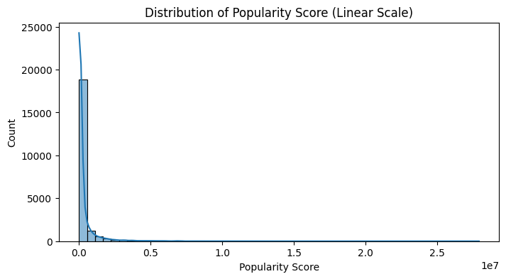
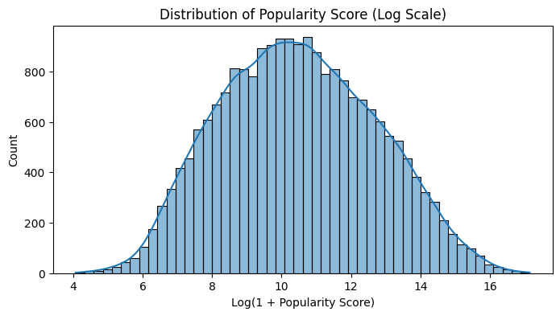
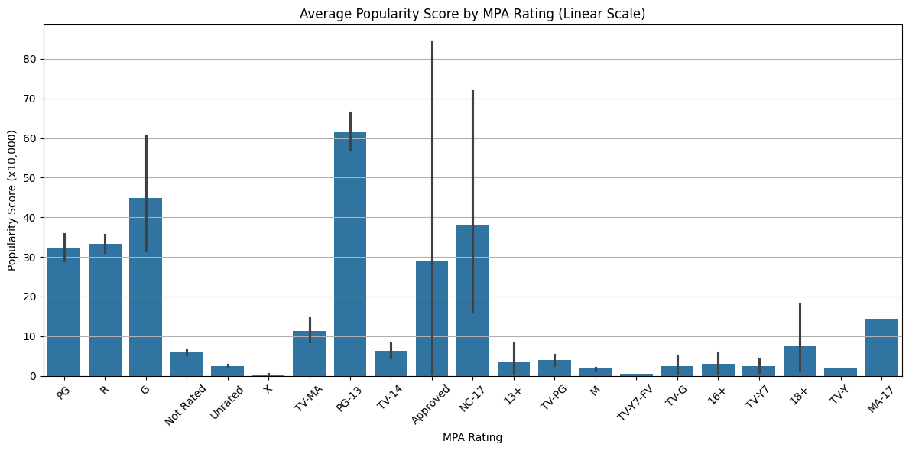
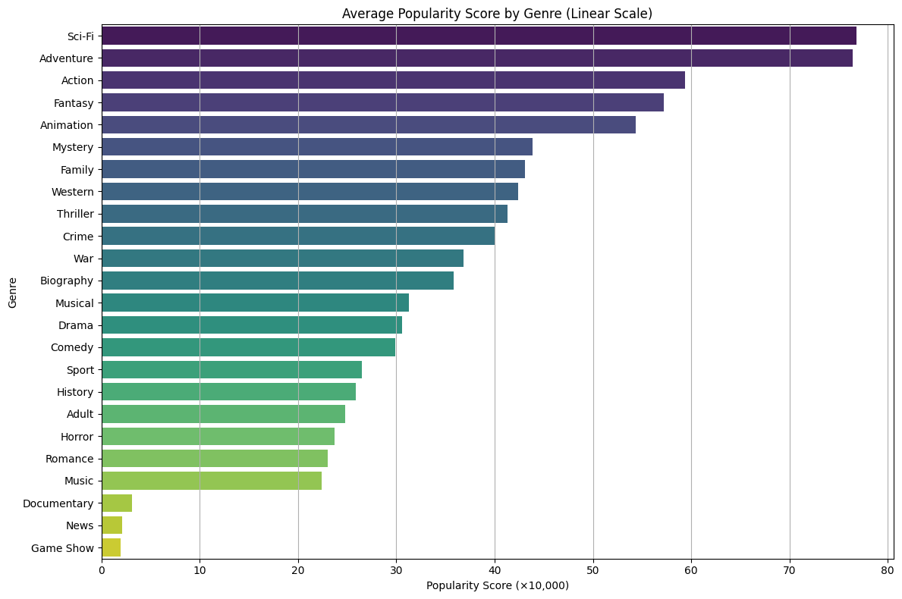

<!-- 주제: 왼쪽 정렬, 두 번째 크기 -->

  <h1>머신러닝을 활용 한 영화의 대중성 예측</h1>

<!-- 팀 소개: 왼쪽 정렬 -->

  
  <h3>✅ 팀 명</h3>
  
<strong>SKN17-EDA-Mini-1Team : 🌸 산하엽(Skeleton Flower) 🌸</strong>

  <h3>🧑‍💻 팀 멤버</h3>
  <!-- 팀 멤버 정보는 여기에 추가하세요 -->

| [김주서](https://github.com/kimjuseo71) | [홍문봉](https://github.com/Glowcloudy) | [양정민](https://github.com/Yangmin3) | [한 훈](https://github.com/Hoonieboogie) | [김주영](https://github.com/samkim7788) |
|:--------------------------------------:|:--------------------------------------:|:-------------------------------------:|:---------------------------------------:|:---------------------------------------:|
|  | |  |  |  |

---

## 🗓️ (Mini)프로젝트 기간
✔️ 2025.07.25 ~ 2025.08.01

## 📖 프로젝트 소개

- 영화에 대한 대중성 예측

## 📌 프로젝트 배경

- 많은 공개 영화 데이터셋에서는 관람객 수나 박스오피스 수익과 같은 직접적인 대중성 지표가 포함되어 있지 않다.
   대중성은 도달 범위(평가 참여 인원- Votes)와 만족도(평균 평점- Rating)의 곱으로 설명할 수 있다. 평가 수는 관심도, 평균 평점은 만족도를 나타내며, 많은 사람이 보고 긍정적으로 평가한 영화일수록 대중성이 높다.
   행동 과학 연구에서도 사람들이 콘텐츠 선택 시 이 두 요소를 함께 고려한다는 점이 확인되었다.

### 📊 Votes × Rating 지표 기반 예측

| 영화 | Votes (투표 수) | Rating (평점) | poularity_score (=Votes × Rating) |
|------|------------------|----------------|----------------|
| B    | 150,000          | 6.0            | 900,000        |
| D    | 64,000           | 8.0            | 512,000        |
| A    | 82,000           | 5.0            | 410,000        |
| C    | 39,000           | 7.0            | 273,000        |

- 이 지수는 단순한 직관을 넘어 실무 분석에서 널리 활용되며, 흥행 예측 모델에서 중요한 변수로 사용되고 있다.

## 출처
  
  (1): Arcelus, F. J., & Srinivasan, G. (2020). Predicting box-office revenues of motion pictures. Journal of the Operational Research Society, 71(3), 364–378.
  🔗 https://doi.org/10.1080/01605682.2019.1574199

  (2):  Analytis, P. P., Barkoczi, D., & Herzog, S. M. (2018). Social learning strategies for matters of taste. Nature Human Behaviour, 2(6), 415–424.
  🔗 https://doi.org/10.1038/s41562-018-0333-2

  (3):  Sharda, R., & Delen, D. (2006). Predicting box-office success of motion pictures with neural networks. Expert Systems with Applications, 30(2), 243–254.
  🔗 https://doi.org/10.1016/j.eswa.2005.07.019

## 🎯 프로젝트 필요성

## 기술 스택
      

## 데이터 출처

https://www.kaggle.com/datasets/raedaddala/imdb-movies-from-1960-to-2023?utm_source=perplexity

## 데이터 전처리 & EDA
### 전처리
1. 1980 ~ 2025년까지의 연도별 CSV 파일을 반복적으로 불러와 하나의 데이터셋으로 병합
2. 문자열 형식의 상영시간을 숫자형으로 Duration_minute 컬럼으로 변환 (예: '2h 4m' → 124)
3. MPA, Rating, Votes 컬럼 중 결측치가 존재하는 행 제거 => 상영등급은 범주형이고 영화 시나리오에 기반하여 등급이 결정되기 때문에 임의로 값 부여 불가, Rating과 Votes는 타겟 임의지표 (popularity_score)를 만들 때 사용하기 때문에 임의 값 부여 불가
4. 불필요한 컬럼 제거 (매출 같은 후천적인 요소나 의미 분석을 해야하는 영화 설명 부분)
5. Votes 정수로 변환 (예: 886K -> 886000, 1.3M -> 1300000)
6. budget 컬럼 환율 변환 (다양한 통화 기호를 파악하고 USD 기준으로 환산)
7. 다중 장르 IMBd가 지정한 공식 장르에 부합하는 장르만 추출
8. 타겟 지표인 popularity_score 열 계산 후 추가
9. (다중 작가, 감독, 배우, 제작사, 제작 국가에 대해서는 전처리 실패)

### EDA

  

선형 스케일 popularity_score:
- 대부분의 영화가 낮은 인기도 점수에 몰려 있고, 소수의 영화만이 매우 높은 인기도 점수를 가지고 있음  
- 데이터가 왼쪽에 밀집되어 있고 오른쪽으로 길게 늘어져 있어 평균값만으로는 대표성을 설명하기 어려움  
- 상위 인기 영화의 영향이 큼: 소수의 인기 영화가 전체 분포에 큰 영향을 미치는 것을 보임  

 

로그 스케일 popularity_score:
- 로그 변환 후에는 인기도 점수가 중심을 기준으로 대칭적인 정규분포를 보임 => **회귀 분석에 용이**
- 로그 변환을 통해 이상치의 영향을 줄이고, 대부분의 영화 인기도 패턴을 더 잘 관찰할 수 있음  
- **모델링 준비 완료: 이처럼 정규화된 분포는 이후 
  
 

PG-13, G, NC-17, Approved 등급에서 비교적 높은 인기도를 보이며, 특히 PG-13이 가장 높은 평균 값을 기록함. 반면, X, TV-Y7-FV, M, TV-G 등 일부 등급은 인기도가 매우 낮음. 전반적으로 등급에 따라 인기도에 차이가 나타나며, **MPA 등급은 popularity_score와 유의미한 연관이 있는 변수임을 알 수 있음. 다만, 일부 등급은 표본 수가 적어 보이는 편차가 클 수 있으므로 해석 시 주의가 필요함.**

  

Sci-Fi, Adventure, Action, Fantasy, Animation 장르가 상대적으로 높은 인기도를 보이는 반면, Game Show, News, Documentary는 낮은 인기도를 기록함. 장르에 따라 인기도에 뚜렷한 차이가 존재하므로, **장르는 popularity_score와 유의미한 연관이 있는 변수임을 알 수 있음**.

- Votes와 Rating은 popularity_score를 계산할 때 사용한 수치들이므로 제외  
- info()로 확인 결과, budget은 결측치가 반이나 되고 예산은 배우들 섭외 비용 혹은 제작 비용에 영향을 미치는 간접적 요소라서 **학습 시 특성에서 제외시키는 것이 타당**

## 예측 모델 결과
**각 모델마다**
- 사용한 모델들 결과
- 성능 향상을 위해 노력한
- 실제 예측 결과

### Linear Regression

### XGBoost

### LightGBM

### SVM 
**<최고 성능 결과>**
| 지표     | 훈련 데이터 | 평가 데이터 |
|----------|--------------|--------------|
| MSE      | 3.3897       | 3.7140       |
| RMSE     | 1.8411       | 1.9272       |
| MAE      | 1.4390       | 1.5399       |
| MSLE     | 0.0277       | 0.0300       |
| RMSLE    | 0.1664       | 0.1731       |
| R²       | 0.3124       | 0.2470       |

**<성능 향상 단계>**  

0. 장르 및 상영등급 One-Hot Encoding 적용
1. 원본 데이터 상태에서 학습 [R²: -0.075(학습),  -0.066(평가)]
2. popularity_score를 로그 스케일로 변환 [R²: 0.189(학습),  0.183(평가)] (아주 큰 성능 향상을 보였음)
3. GridSearchCV 적용 [이전 단계와 거의 동일한 성능을 보임] (최적의 파라미터: C=1, epsilon=0.1, kernel= 'rbf')

## 한계점 및 개선 방향
본 연구에서 사용된 데이터셋은 감독, 배우, 제작사, 제작 국가 등의 컬럼이 문자열 형태로 존재하며, 이들에 대한 정량적 특성화가 이루어지지 않았다. 이러한 변수들은 현실 세계에서 작품의 인지도, 흥행 가능성, 대중의 기대치 등에 영향을 미칠 수 있는 **사회적 영향력 또는 권위성**을 내포하고 있으나, 본 모델에서는 이를 단순 범주형 문자열로 간주하였다. 이로 인해, 유명 감독이나 세계적인 제작사의 참여 여부처럼 예측력 있는 요인들이 학습되지 못하였고, 이는 전반적인 모델 성능 저하에 기여했을 가능성이 매우 크다. 따라서 향후 연구에서는 감독 및 배우의 과거 흥행 성적, 제작사의 평균 투자 규모, 국가별 산업 규모 등 외부 정보를 결합한 정량적 가중치 모델링이 필요하다.

## 회고
- **김주서**:선형회귀 모델에 대해 이해가 쉽게 이해가 가지 않았다. 솔찍히 지금도 어렵게 느껴지는것이 사실이나 계속 노력하고 있다. 다음에는 다른 모델을 사용해 문제를 풀어봐야 겠다는 생각을 하게 됐다.
- **홍문봉**: 처음에 주제를 정하는 과정에서 여러가지 주제들이 나왔지만 결국 제가 추천한 주제로 선택이 되어 큰 그림은 팀원들이 이해를 하고 있지만 세세한 부분에서는 조율해야 하는 부분과 각각의 팀원들에게 작업 할당량을 부여 및 결과 도출에서 굉장히 힘들었습니다. 또한 어떻게 하면 우리의 가설에 대해 타당성이 있고 남들이 봤을 때 바로 이해할 수 있는 그래프를 찾는데 시간이 많이 소요되었으며 처음 그려보는 트리맵의 경우 각가의 박스사이 빈 공간이 생기는 이슈 해결을 위해 pad=False를 활용하여 박스 사이 공백을 매꾸었으며 각각의 장르의 평균 러닝타임을 구하는 방식에서 for문을 이용하여 각 장르별 평균러닝타임을 구하여 트리 맵에 표현 할 수 있었습니다.
- **양정민**: 처음 모델을 학습 할 때 시간이 부족하지 않으려나 싶어 여러개의 모델을 학습 시켰는데 정확성 이 높게 나와 생각보다 괜찮네? 하다 혹시나 해서 다른 모델들 값도 확인 해보니 전부 점수가 높아 뭔가 이상하다 싶어서 확인 해보니 한번에 여러개의 모델을 돌리면서 데이터 또한 이상하게 넣는 실수를 하여 값이 중구난방으로 나오는 경험을 겪고나니 괜히 일을 빨리하기 위해 제대로 확인도 안하고 성급하게 만든거 같아 반성을 하며 하나의 모델이라도 정확하게 제대로 하자 싶어 한가지 모델을 돌려서 괜찮은 결과를 얻고나서 시간이 오래 걸리더라도 확실하게 만들지 못한 코드는 아무런 의미도 가치도 없다는걸 다시 한번 깨달았습니다. 또한 한번에 여러가지 일을 하며 창을 여러개 띄워놓고 작업을 이것저것 하다보니 헷갈려서 한 실수인듯 하여 확실하게 한가지 일을 하는 방향으로 갈피를 잡았습니다.
- **한 훈**: 전체 프로젝트 시간의 95%를 기획, 데이터 수집, 전처리 및 EDA(탐색적 데이터 분석)에 할애하면서 '역시 인공지능은 데이터가 핵심이구나'라는 것을 뼈저리게 다시 깨달았습니다. 단순히 기술 사용법을 익히는 것을 넘어, 어떻게 해야 올바르게 적용할 수 있을지 많이 배울 수 있었던 뜻깊은 시간이었습니다.
- **김주영**: XGB Regressor와 LightGBM Regressor를 사용하여 모델을 학습시켰으나, 다른 모델들에 비해 성능이 좋지 않았다. 학습 과정에서 두 모델 모두 시간이 오래 걸렸고, 다양한 하이퍼파라미터를 조정하며 여러 번 학습을 시도했지만 변경 후 결과가 오히려 기본 설정에서의 성능보다 낮게 나와 어떤 부분을 개선해야 할지 파악하기 어려웠다.
하이퍼파라미터와 Grid Search를 활용하여 조정하는 방식으로 성능을 향상시켰다. 이번 프로젝트를 통해 모델의 성능을 향상시켜 결과를 도출하였지만 한정된 데이터로 인해서 원하는 결과를 도출하지 못한점에 대해서 아쉬움이 남았다.
